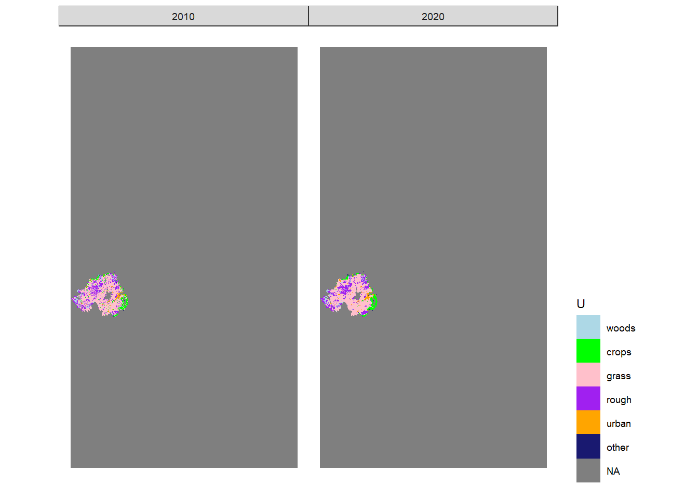
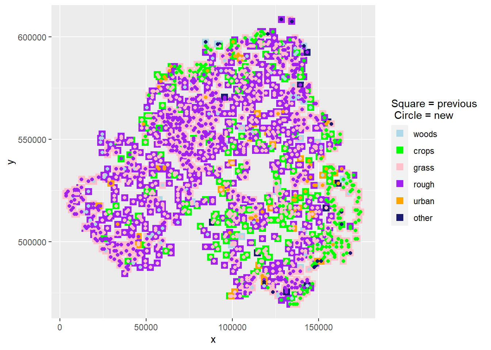
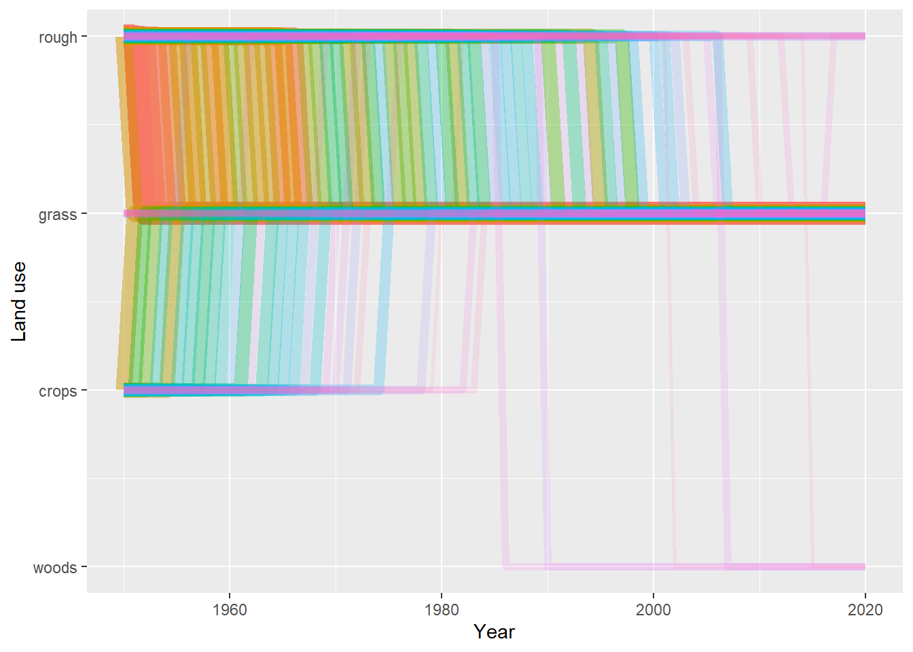
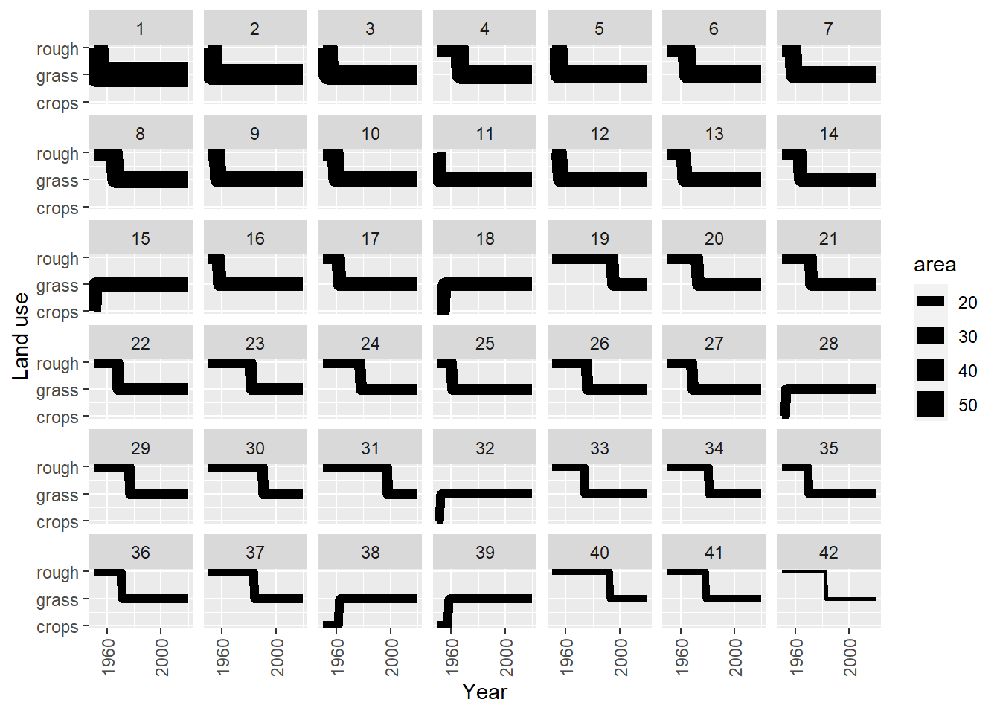

# Results: Northern Ireland
<!--- { rendering -->

<!--- } -->

The figures below show the results of the data assimilation procedure. All the data sets shown were used in the algorithm, but their relative random uncertainties ($\sigma$) determined how much influence they have on the estimates. The spatial data sets were corrected for systematic uncertainties, using the estimated net false positive rate ($F_P$). Having estimated the posterior distribution of the $\beta$ matrix, we used this to simulate multiple maps of land use going back in time to 1950. The maps of the likelihood of transition to each land use established in WP-A were updated dynamically, using the life tables described in Section 5.

(\#fig:plotB) Observations and posterior distribution of the transition matrix $\mathbf{B}$, representing the gross area changing from the land use in each row to the land use in each column each year from 1950 to 2020. The grey shaded band shows the 2.5 and 97.5 percentiles of the posterior distribution. The maximum *a posteriori* estimate is shown as the solid black line within this. Observations from the different data sources are shown as coloured circles. The coloured solid lines show the corrected observations after accounting for systematic uncertainties, and interpolating. The coloured bands around these lines show the random uncertainty, rescaled as $\sigma /5$ to keep with the axis scale. Because the random uncertainties and the corrections to the observations are generally very large in comparison to the actual change, scaling the axes is difficult. Note that a consistent colour scheme for the data sources is shown, but not all contribute to every figure.

(\#fig:plotG) Observations and posterior distribution of the gross gain in area of each land use $\mathbf{G}$ from 1950 to 2020.  The grey shaded band shows the 2.5 and 97.5 percentiles of the posterior distribution. The maximum *a posteriori* estimate is shown as the solid black line within this. Observations from the different data sources are shown as coloured circles. The coloured solid lines show the corrected observations after accounting for systematic uncertainties, and interpolating. The coloured bands around these lines show the random uncertainty, rescaled as $\sigma /5$ to keep with the axis scale. Because the random uncertainties and the corrections to the observations are generally very large in comparison to the actual change, scaling the axes is difficult. Note that a consistent colour scheme for the data sources is shown, but not all contribute to every figure.

(\#fig:plotL) Observations and posterior distribution of the gross loss of area from each land use $\mathbf{L}$ from 1950 to 2020.  The grey shaded band shows the 2.5 and 97.5 percentiles of the posterior distribution. The maximum *a posteriori* estimate is shown as the solid black line within this. Observations from the different data sources are shown as coloured circles. The coloured solid lines show the corrected observations after accounting for systematic uncertainties, and interpolating. The coloured bands around these lines show the random uncertainty, rescaled as $\sigma /5$ to keep with the axis scale. Because the random uncertainties and the corrections to the observations are generally very large in comparison to the actual change, scaling the axes is difficult. Note that a consistent colour scheme for the data sources is shown, but not all contribute to every figure.

(\#fig:plotD) Time series of the net change in area occupied by each land use ($D$) from 1950 to 2020, showing the observations and posterior distribution of estimates. The grey shaded band shows the 2.5 and 97.5 percentiles of the posterior distribution. The maximum *a posteriori* estimate is shown as the solid black line within this. Observations from the different data sources are shown as coloured circles. The coloured solid lines show the corrected observations after accounting for systematic uncertainties, and interpolating. The coloured bands around these lines show the random uncertainty, rescaled as $\sigma /5$ to keep with the axis scale. Because the random uncertainties and the corrections to the observations are generally very large in comparison to the actual change, scaling the axes is difficult. Note that a consistent colour scheme for the data sources is shown, but not all contribute to every figure.

(\#fig:plotUt)Estimated state of land-use in 2010 and 2020 in one realisation of $U$ from the maximum *a posteriori* estimate of $B$.

(\#fig:plotUd)The spatial distribution of land-use change between 2010 and 2020 in one realisation of $U$ from the maximum *a posteriori* estimate of $B$. At each location where land use has changed, the use in 2010 is shown as a coloured square, and the use in 2020 is shown as a coloured circle within this

(\#fig:plotv1)Trajectories of the 100 land-use vectors in the posterior $U$ with the largest areas (excluding the six vectors which show no change). Each vector of land use is shown in a different colour, varied arbitrarily to differentiate different vectors. Line thickness and opacity are proportional to the total area occupied by each vector, so that the dominant vectors are the most visually obvious.

(\#fig:plotv2)Trajectories of the 42 land-use vectors in the posterior $U$ with the largest areas (excluding the six vectors which show no change). Line thickness is proportional to the total area occupied by each vector.

(\#fig:plotcgr)Trajectories of the land-use vectors in the posterior $U$ which involve rotational change between crop and grassland (i.e. those which include either (i) transitions from crop to grass and then subsequently from grass to crop, *or* (ii) transitions from grass to crop and then subsequently from crop to grass). Each vector of land use is shown in a different colour, varied arbitrarily to differentiate different vectors. Line thickness and opacity are proportional to the total area occupied by each vector, so that the dominant vectors are the most visually obvious.

