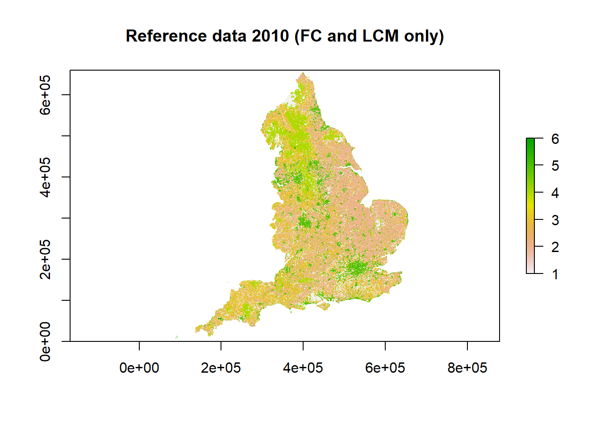

# Quantifying Systematic Uncertainty in Land-Use Data Sources

## Introduction

The spatial datasets used in the data assimilation for Land Use Tracking will contain systematic errors, related to falsely detecting land-use change when it has not occurred, and missing true land-use change when it does occur.
To characterise uncertainties in the data, we want to quantify these false positive and false negative detection rates.
These can be estimated by comparison with a reference dataset, and thereby judging where the observed changes in a given data set are correctly identified or not.
For observations of the $B$ matrix, this is complicated by the fact that they form a 6 x 6-way classification. When considering land-use *change*, we need to compare the 36 elements of this classification from one data source with another (or the truth), so we have a 36 x 36 error matrix (or "confusion" matrix). This matrix has two distinct types of errors that we ideally want to distinguish: false positives and false negatives, or "user"/"commission" and "producer"/"omission" error/accuracy, in the terminology commonly used in remote sensing.

As with estimating random uncertainty, a limitation is that none of the data sources represents absolute truth, and we have no definitive data set against which to make this assessment.

### Representation of systematic uncertainty
Our approach here is to explicitly represent the false positive and false negative error terms in the likelihood function. False positives cause observations to over-estimate change, whilst false negatives produce an under-estimate, and the estimated bias in the observation is a simple function of these error rates ($F_P$ and $F_N$). The likelihood equation becomes:

\begin{equation} \label{eq:likBetaDelta}
 \mathcal{L} = \frac{1}{\sigma_{ij}^\mathrm{obs} \sqrt{2\pi}} \mathrm{exp}(-((1-F_P) \beta_{ij}^{\mathrm{obs}} + A_N F_N - \beta_{ij}^{\mathrm{pred}})^2/2 {\sigma_{ij}^\mathrm{obs}}^2)
\end{equation}

where $A_N$ is the area in which the false negative errors can occur, given by the number of grid cells where the land-use change $ij$ was not detected. This equation calculates the likelihood of the observed change from land use $i$ to land use $j$, given that the true value is $\beta_{ij}^{\mathrm{pred}}$, and with given false positive and false negative rates $F_P$ and $F_N$, and random uncertainty $\sigma_{ij}^\mathrm{obs}$ in the observation. This approach can be implemented in increasingly complex ways:

* estimating the false positive and false negative error rates based on some set of confusion matrices, and thereafter assuming them to be fixed and constant for a given data source;

* as above, but calculating false positive and false negative error rates specific to each type of land-use change (i.e. $F_{Pij}$ and $F_{Nij}$), and potentially vaying in time;

* including the false positive and false negative error rates as unknown parameters to be calibrated, along with the $B$ and $\sigma^{\mathrm{obs}}$ values. This is the most sophisticated solution, as it properly represents the fact that these are not truly known, and allows the values to be an emergent property of the data, given prior information, rather than imposing our guesses.  The exact number of these parameters to estimate could vary as above, whether specific to each data source, type of land-use change, and point in time.
    

## Methods
We explored the variability in false positive and false negative rates in the datasets at the land-use, data-source and time levels to identify the most appropriate way to account for uncertainty in the data assimilation. The definition of the reference data, calculation of false positives and negatives, and application of these values into the likelihood function is presented below.


### Creating reference datasets:
We created the reference data by combining several spatially explicit data sources that are thought to have the highest accuracy and reliability for certain land use types, namely FC, IACS and LCM. These data-sources were added to the reference dataset in order of expected reliability: land use defined in FC data took precedence over IACS, followed by LCM. This resulted in a reference dataset that includes the majority of forest cells from FC, the majority of crop, grass and rough grazing from IACS and the majority of urban and other cells from LCM. 
This reference data was used to compare the other data-sources against (LCC, CORINE, CROME). In order to test FC, IACS and LCM themselves, we removed the respective dataset from the reference data, and tested land-use change classifications against those present in the remaining reference data (e.g. testing the forest, crop, grassland or rough grazing land-use change in IACS against that defined in FC and LCM).

This method enabled us to build reference rasters for England for 2006, 2010, 2015, 2017, 2018 and 2019. The 2010 reference raster comprising FC, IACS and LCM data is shown below, as well as the 2010 reference raster for testing IACS (comprising FC and LCM data).


The table below shows the reference data used for each data source:


|Dataset |Reference     |
|:-------|:-------------|
|FC      |IACS, LCM     |
|IACS    |FC, LCM       |
|LCM     |FC, IACS      |
|LCC     |FC, IACS, LCM |
|CORINE  |FC, IACS, LCM |
|CROME   |FC, IACS, LCM |


Each data source was tested against its appropriate reference data according to the table above. The resulting 36*36 confusion matrix quantifies the correspondence between the data sets, in terms of their agreement over the area of each land use changing to every other land use. The diagonal identifies the area of land-use change that was identified to occur in both the reference and test data sets. The unchanging land on the diagonal can be disregarded as not relevant here. 

### False positive rates
The false positive rate was calculated as: 

$F_{Pij}$ = ($\beta_{test,ij}$ - $\beta_{ref,ij}$)/ $\beta_{test,ij}$

where $\beta_{test,ij}$ is the observed area of land changing from use $i$ to $j$ in the test dataset and $\beta_{ref,ij}$ the corresponding value in the reference dataset.

### False negative rates
The false negative rate, the rate of failing to observe land-use change from $i$ to $j$ in the test dataset compared to the reference dataset, was calculated as:

$F_{Nij}$ = ($\beta_{ref,ij}$ - $\beta_{ref,test,ij}$)/ ($A$ - $\beta_{test,ij}$)

where $\beta_{ref,test,ij}$ is the area of land changing from $i$ to $j$ identified in both the reference and test data sets, and $A$ is the total area of England. The denominator is thus the total land area where false negatives could occur.

## Results
Here we use CORINE as an example showing the false positive and negative rates calculated between the data source and the reference dataset between 2006 and 2018 (most recent years available for comparison). The data shows the trend across all of the data-sources: very high false positive rates, with slightly lower false positive rates for the land-use change between crop and grassland. False negative rates were much lower, but are expressed on a very different basis, and not directly comparable. The matrices below show the false positive/negative rate for each land-use change between the first year (row) and the second year (column).

False positive rates for CORINE between 2006 and 2018:


|      |woods |crops |grass |rough |urban |other |
|:-----|:-----|:-----|:-----|:-----|:-----|:-----|
|woods |      |1     |0.992 |1     |1     |0     |
|crops |0.977 |      |0.928 |0.949 |0.994 |1     |
|grass |0.951 |0.767 |      |0.996 |0.991 |1     |
|rough |1     |1     |1     |      |1     |1     |
|urban |1     |1     |0.985 |1     |      |1     |
|other |0     |1     |1     |1     |0     |      |

False negative rates for CORINE between 2006 and 2018:


|      |woods |crops |grass |rough |urban |other |
|:-----|:-----|:-----|:-----|:-----|:-----|:-----|
|woods |      |0     |0.001 |0     |0     |0     |
|crops |0.004 |      |0.038 |0.001 |0     |0     |
|grass |0.01  |0.053 |      |0.009 |0.001 |0     |
|rough |0     |0     |0.011 |      |0     |0     |
|urban |0.004 |0     |0.002 |0.003 |      |0     |
|other |0     |0     |0     |0     |0     |      |

The following graphs show the false positive and false negative rates for each data source, with the grid of graphs showing the land use type in the first year and colour showing the land use in the second year.

False positive rates:


False negative rates:


### Data-source-specific false positive and false negative rates

Based on the relatively low variability in false positive rates identified for many of the land-use change classes, we chose to summarise false positive rates at the data-source level rather than land-use level. Data-set level false positive rates were calculated as an average of the land-use level false positive rate, weighted by area of each land-use change. 

This gave the following outputs which can be incorporated into the data assimilation method:

|Data source |        Fn|        Fp|
|:-----------|---------:|---------:|
|FC          | 0.0020230|        NA|
|LCM         | 0.0013481| 0.8711168|
|CORINE      | 0.0060332| 0.9029868|
|LCC         | 0.0012670| 0.6737150|
|IACS        | 0.0020691| 0.7997226|
|CROME       | 0.0012571| 0.9329713|

### Updating $B, D, G$ and $L$

To examine the effect of these systematic biases on the observations, we can recalculate the $B$ transition matrix. An example is provided below for IACS from 2005 to 2019:


## Conclusions

* We can represent data source-specific systematic uncertainty by estimating appropriate false positive and false negative rates for each data source, and adding these terms to the likelihood function.
* Again, the most fundamental problem is the absence of any data which we regard as "true". There is no immediate solution to this, and a pragmatic approach is to define a reference data set, with more or less subjectivity/expert judgement, and principles from cross-validation.
* False positive rates appear to be very high, but are consistently so across most of the land-use categories. With this in mind, we use data-set level $Fp$ and $Fn$ values rather than land-use level values. 


```
## Computation time (excl. render): 53.04 sec elapsed
```
