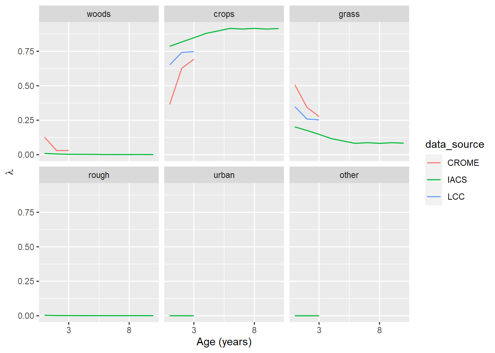
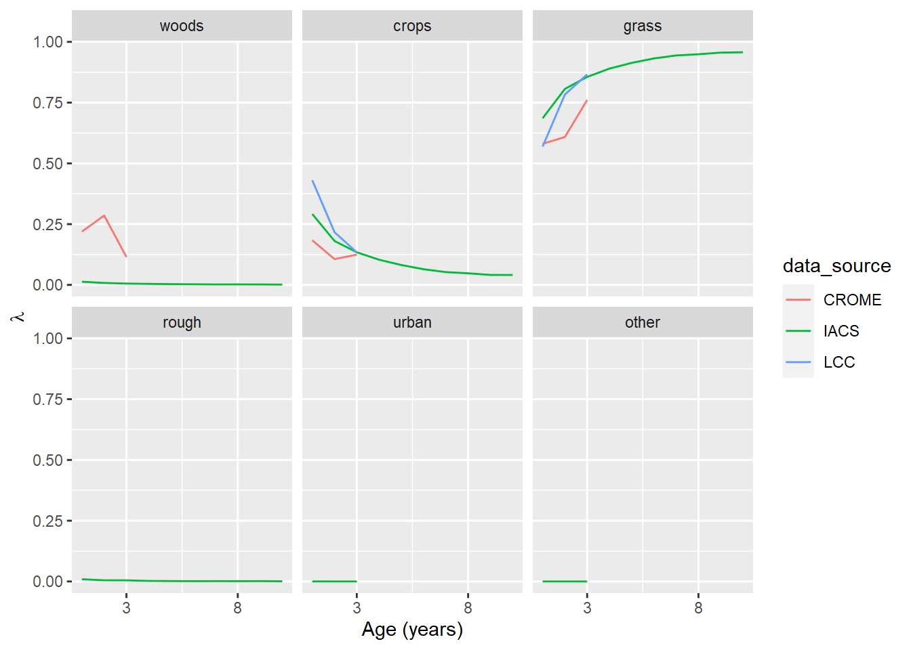

# Using life tables in modelling land-use change

<!--- { rendering -->

<!--- } -->


## Introduction

This section describes the concept of life tables in modelling land-use change. In the current procedure, we firstly estimate the $B$ matrix each year by MCMC, then estimate where these land-use changes take place in a separate step. This second step uses static maps of likelihood for each land use. That is, for each year, we have a raster containing the likelihood of a given land-use occuring in each cell. This is based on observed data; if several data sets agree that a given cell is used for crops in a given year, there is a high likelihood of any new cropland being placed there by the algorithm (if it is not already cropland). However, these likelihood maps are static: they vary over time according to the data, but they are the same in every simulation. What this misses is the dependence of land-use change on prior history in the grid cell. There are a few cases where this is important. Most importantly, there is rotational grassland, which is used for arable crops for a number of years, before being returned to grassland on a repeating cycle. Thus, the likelihood of grassland changing to cropland is higher for a four-year old grassland than a 50-year old grassland. This phenomenon is not well captured in the current method. For forests, deforestation may be more likely to occur where the trees are at a commercially harvestable age, so the likelihood of transition is not constant, but peaks at around 40-60 years. More generally, land use shows inertia, and change is less likely where no change has happened before.

To capture such "memory" effects (i.e. that the time since past land-use change affects the likelihood of current land-use change), we can use an approach borrowed from population modelling based on "life tables". In the population modelling context, life tables are a set of age-specific mortality rates. The same idea is referred to as survival analysis, reliability analysis, ot time-to-event analysis in various domains. Here, we are modelling the "survival" of land under a given continuous usage. Using the population analogy, a forest is "born" when a grid cell is afforested (from any other previous land use), and "dies" when it is deforested (converted to any other previous land use). Similarily, the same applies when areas of other land uses are created or destroyed.
We can think of this as six populations (woods, cropland, grassland, rough grazing, urban or other land uses), each of which has a specific life table. In this context, rather than mortality rates, the life table is the set of age-specific probabilities of conversion to other uses. So rather than a single dimension, each life table has six columns, for the probabilities to conversion to each of the five other land uses, plus the probability of remaining unchanged.

## Methods
We established the life tables based on observed data, by counting the frequency of the length of all contiguous land uses. The land-use vectors derived from the IACS, CROME, and LCC data sets were used to do this for the six land-use classes considered here.
Within these, for each land use, we performed a cross-tabulation of the frequency of transitions to every other land use with age.
That is, taking crops as an example, we counted the occurrences of:

- 1-year old crops changing to woods, 
- 1-year old crops remaining as crops, 
- 1-year old crops changing to grasslands, 
- 1-year old crops changing to rough grazing, 
- ... etc., and
- 2-year old crops changing to woods, 
- 2-year old crops remaining as crops, 
- 2-year old crops changing to grasslands, 
- 2-year old crops changing to rough grazing, 
- ... etc., 

and so forth, up to an age of 10 years, the longest span of continuous data available (in IACS).  Normalising by total count, we can convert these frequencies to estimated probabilities.
These transition probabilities are usually denoted $\lambda$ in the context of population modelling (probability of mortality).


## Results
The life tables for cropland and grassland over the first ten years are shown in Figures \@ref(fig:plotLFcrops) and \@ref(fig:plotLFgrass).

<div class="figure">

<p class="caption">(\#fig:plotLFcrops)The transition probability, $\lambda$, for cropland as a function of its age (i.e. time since previous land use). The panel labelled 'crops' shows the probability of cropland remaining cropland.</p>
</div>

<div class="figure">

<p class="caption">(\#fig:plotLFgrass)The transition probability, $\lambda$, for grassland as a function of its age (i.e. time since previous land use). The panel labelled *grass* shows the probability of grassland remaining grassland.</p>
</div>


The three data sources show similar patterns, although initial change is generally steeper in CROME and LCC. A 10-year time span is only available in IACS, so definitive comparisons are not possible.  In the case of both crops and grasslands, the probability of remaining unchanged increases asymptotically with age; the probability of  changing use decreases correspondingly. The most likely transition for cropland is to grassland, and vice versa. The probability of other conversions remains low and roughly constant. 


## Discussion
The code for the data assimilation algorithm was adapted to use the life tables dynamically to calculate the likelihoods $\mathcal{L}$ in sampling $U$, going back in time from 2019. Previously, the likelihood calculation was done as a pre-processing step, to calculate a number of static maps, one per year. 
This is now done dynamically, muliplying a spatial likelihood term $\mathcal{L}_\mathrm{static}$ with the dynamic likelihood term $\mathcal{L}_\mathrm{dynamic}$ (depending on the age of the current land use). Because $\mathcal{L}_\mathrm{dynamic}$ depends only on the age (and not the whole previous history), we simply need to update a raster containing the age of each land use each year. This requires an initial estimate from which to start, and then works backwards.

Note that the absolute values in the life tables are not critical; the actual number of cells changing use is determined when we estimate the $\beta$ matrix values.
Indeed, there are reasons not to trust the absolute values as they will include all the false positives discussed in previous sections.
It is the shape of these curves with age that is important.
Given we know how many cells are changing from (say) crop to grass each year, the table determines the relative likelihood of this occuring in new croplands versus older more established croplands.
Because the possibility of change occurs at every location every year, rotational land use is an emergent property of the simulations, at a frequency approximately the same as in the observed data.
In principle this can occur with any land use, but is only really significant with changes between crops and grass.


```
## Computation time (excl. render): 1.28 sec elapsed
```
