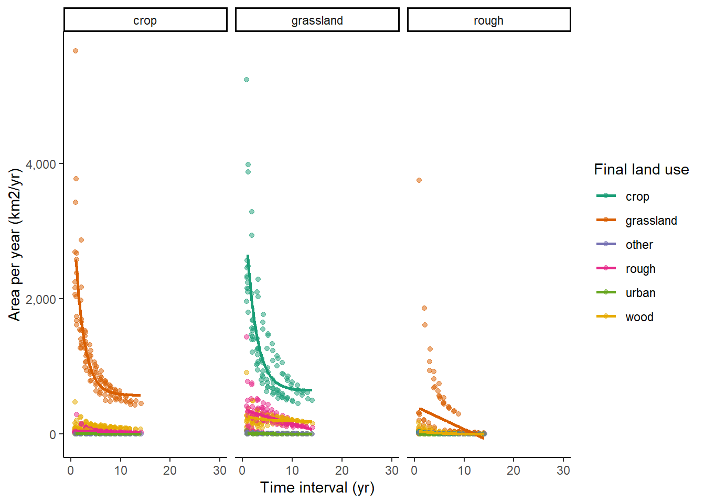
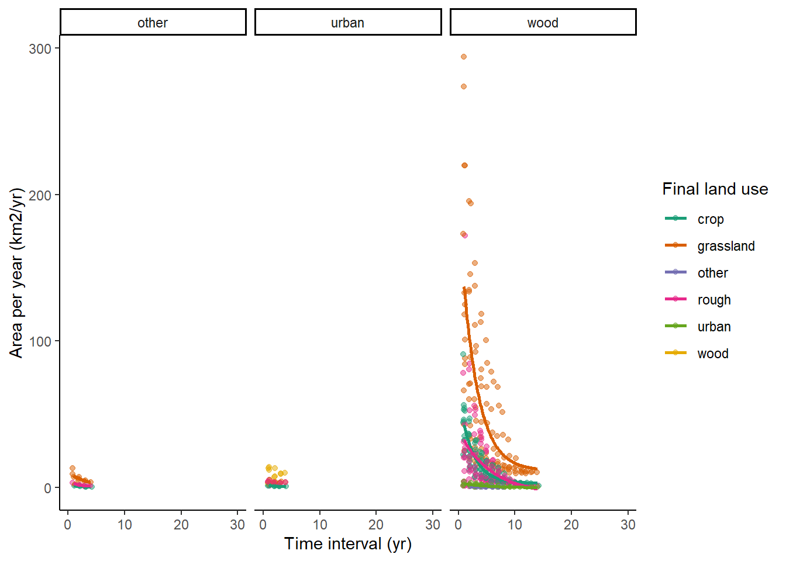
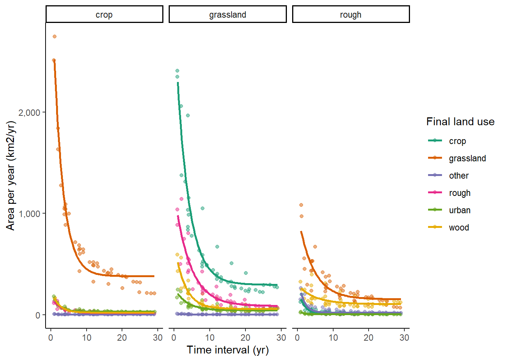
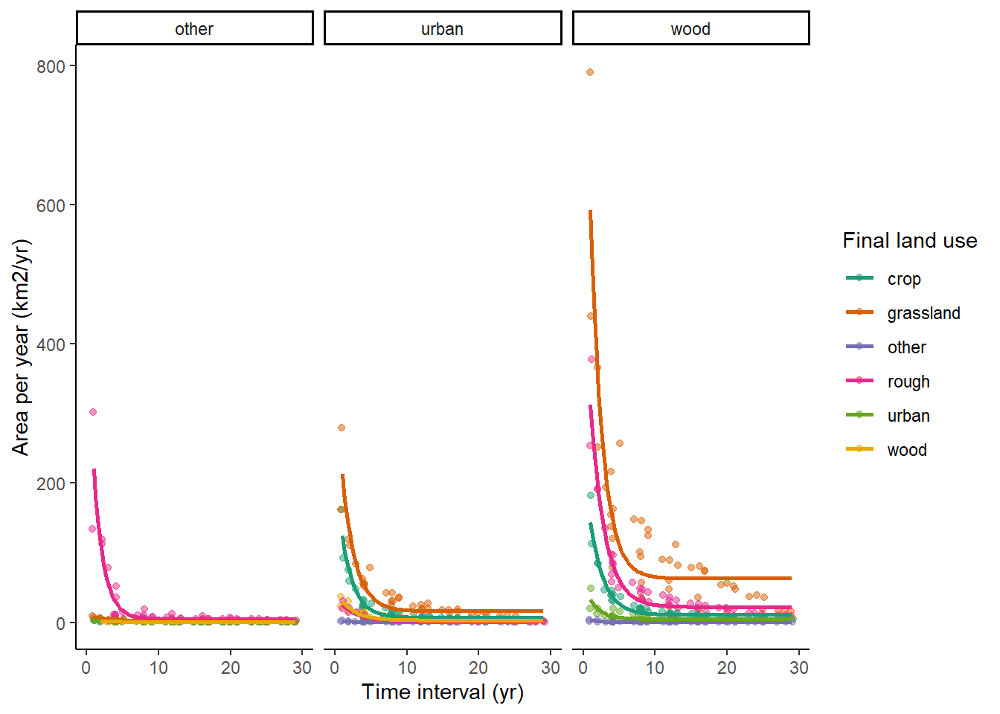
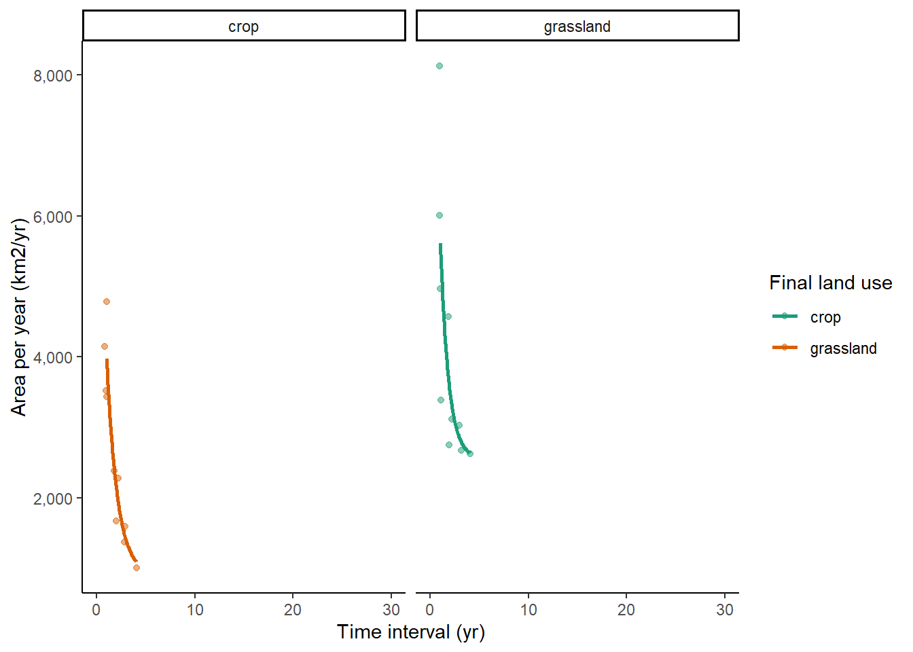
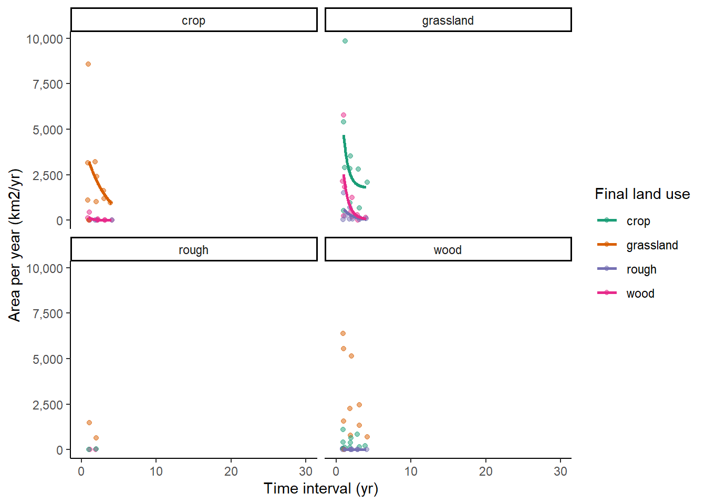
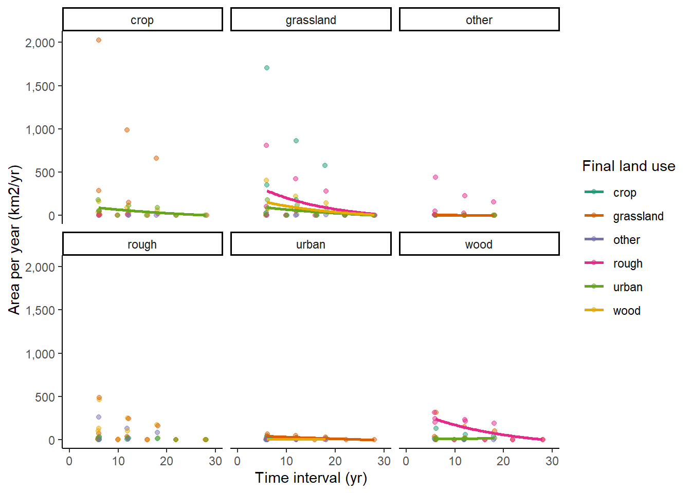

# Assessing systematic errors in estimates of land-use change: sensitivity to survey-interval length

## Introduction

The spatial datasets used in the data assimilation for Land Use Tracking will contain systematic errors, related to falsely detecting land-use change when it has not occurred, and missing true land-use change when it does occur.
To characterise uncertainties in the data, we want to quantify these false positive and false negative detection rates.
These have previously been estimated by comparison with a reference dataset, and thereby judging where the observed changes in a given data set are correctly identified or not.  However, this depends on the validity of the reference dataset as a standard for comparison, and we know that the reference data set is imperfect. Here we use an alternative method that assesses these error rates by analysing the apparent rate of land-use change as a function of the time interval between surveys. In the absence of systematic errors, no relationship with survey-interval length would be expected, and any apparent sensitivity can be used to infer the error rates.

The observed area changing from one land-use type $i$ to another $j$ between two surveys, $\beta_{ij}^{\mathrm{obs}}$ (in km$^2$ yr$^{-1}$), will be made up of the true rate of change, $\beta_{ij}$ and systematic and random error terms. Systematic errors comprise false postive ($F^P$) and false negative rates ($F^N$). Together with the random error term $\epsilon_{ij}$, we can express our expectation for the observations to be:

\begin{equation} \label{eq:beta_errors}
\beta_{ij}^{\mathrm{obs}} = \beta_{ij} + (F_{ij}^P - F_{ij}^N) + \epsilon_{ij}
\end{equation}

As a broad approximation, we can assume that the true rate of land-use change, and the error rates, are approximately constant in time. With short intervals between surveys, there will therefore be proportionately less true change, but the magnitude of the errors will be the same. Conversely, with long intervals between surveys, the magnitude of the errors will still be the same, but there will be proportionately more true change.
As the time difference between surveys increases, the observed rate will tend towards an asymptote, equal to the true mean rate of land-use change, $\overline{\beta_{ij}}$, as the random error term $\epsilon_{ij}$ has a mean of zero. 
We can therefore examine the apparent rate of land-use change as a function of the time interval between surveys, and infer the error rates from this relationship.
It is not possible to explicitly separate $F^{P}$ and $F^{N}$ in this analysis, only their net effect $F^{\mathrm{net}} = F^{P} - F^{N}$, although the shape of curve indicates which is larger in the data. If $F^{P}$ and $F^{N}$ were zero, or exactly balancing each other, the data would show a flat line in the figures below. For the datasets we are testing here, in all cases it appears that false positives are the major source of error.

This method is potentially superior to estimating error rates by comparison with a reference dataset, as it does not require reliable ground-truth data, and only uses intrinsic properties of the observations. As a down-side, the error rates calculated apply to ongoing directional change, and any rotational change is effectively included in the error term. However, we note that this is only really an issue with crop-grass transitions (and v.v.), and we estimate, this affects around ~7 % of the grassland area (assuming that half the area of grassland < 5 years old has a rotation length shorter than the observation period). The method also assumes that the true mean rate of land use change has not changed systematically over the observation period.

## Methods

- Calculate beta matrices for land-use change with all possible permutations of between-survey intervals available with each data source
- Plot the relationship between time-interval length ($\Delta$) and the apparent rate of land-use change
- For each term in the $\beta$ matrix, we fit an exponential model to the data using nonlinear least squares: 

\begin{equation} \label{eq:asymptote}
\beta_{ij\Delta}^{obs} = \overline{\beta_{ij}} + (A_0 - \overline{\beta_{ij}}) \mathrm{exp(-exp}(k) \Delta)
\end{equation}

where $\overline{\beta_{ij}}$ is the asymptotic value, equal to the long-term mean rate of land-use change, $A_0$ is the intercept at $\Delta = 0$, and $k$ is the natural logarithm of the rate constant.

From the fitted model, we obtain estimates of $\overline{\beta_{ij}}$ and the value of $\beta_{ij\Delta}^{obs}$ as a function of the time interval $\Delta$.
We can then estimate the mean net error rate for a given time interval from the fitted curve, expressing this as a fraction of the observed rate:

\begin{equation} \label{eq:Fnet_errors}
F_{ij\Delta}^\mathrm{net} = (\beta_{ij\Delta}^{\mathrm{obs}} - \overline{\beta_{ij}}) / \beta_{ij\Delta}^{\mathrm{obs}}
\end{equation}

## Results

In almost all cases, we see very strong sensitivity to survey-interval length, with much higher apparent rates of change observed at short interval lengths.  This implies the observations are dominated by false positives; no relationship would be expected in the absence of such errors.  Similar trends are seen in all the data sets examined here. 

### IACS:

### LCM

LCM has the greatest number of datasets to apply this method to with 10 surveys conducted across 29 years. This enables comparison between surveys that give 23 time intervals.

### LCC:

LCC only includes crop and grassland land use change so there are less data to test.

### CROME:

Both CROME and CORINE have few surveys meaning estimating a fit to this data is difficult:

### CORINE:

### Summary Table

The table below shows the error rate for all of the different land use change categories for each of the different data sets. These are calculated for the typical time interval in each of the different data sources.

|luc             | IACS|  LCM|  LCC| CORINE| CROME|
|:---------------|----:|----:|----:|------:|-----:|
|crop_grassland  | 0.78| 0.85| 0.77|     NA|    NA|
|crop_other      | 0.82| 0.87|   NA|     NA|    NA|
|crop_rough      | 0.68| 0.87|   NA|     NA|    NA|
|crop_urban      | 0.96| 0.80|   NA|     NA|    NA|
|grassland_crop  | 0.76| 0.87| 0.55|     NA|  0.62|
|grassland_other | 0.78| 0.84|   NA|     NA|    NA|
|grassland_urban | 0.83| 0.79|   NA|     NA|    NA|
|grassland_wood  | 0.28| 0.89|   NA|     NA|  0.98|
|other_rough     | 0.66| 0.98|   NA|     NA|    NA|
|rough_crop      | 0.89| 0.90|   NA|     NA|    NA|
|rough_urban     | 0.96| 0.82|   NA|     NA|    NA|
|urban_crop      | 0.65| 0.94|   NA|   0.87|    NA|
|wood_crop       | 0.93| 0.93|   NA|     NA|    NA|
|wood_grassland  | 0.92| 0.89|   NA|     NA|    NA|
|crop_wood       |   NA| 0.87|   NA|     NA|  0.98|
|grassland_rough |   NA| 0.91|   NA|     NA|    NA|
|other_crop      |   NA| 0.86|   NA|   0.95|    NA|
|other_grassland |   NA| 0.83|   NA|   0.95|    NA|
|other_urban     |   NA| 0.87|   NA|     NA|    NA|
|rough_grassland |   NA| 0.82|   NA|     NA|    NA|
|rough_other     |   NA| 0.90|   NA|     NA|    NA|
|rough_wood      |   NA| 0.60|   NA|     NA|    NA|
|urban_grassland |   NA| 0.92|   NA|     NA|    NA|
|urban_other     |   NA| 0.93|   NA|     NA|    NA|
|urban_rough     |   NA| 0.93|   NA|     NA|    NA|
|urban_wood      |   NA| 0.90|   NA|   0.90|    NA|
|wood_other      |   NA| 0.91|   NA|     NA|    NA|
|wood_rough      |   NA| 0.93|   NA|     NA|    NA|
|wood_urban      |   NA| 0.85|   NA|   0.73|    NA|

The figure below shows the same data plotted for all data sources.

## Discussion and Conclusions

The error rates we obtain from this method are similar to those derived from comparison with the reference data set. The net positive error rates are generally in the range 80-98 %; that is, 80-98 % of the ostensibly observed land-use change did not actually occur. Almost all other values in the range 50-80 % (with only one exception less than this). 
The conclusion from this is that these observations are extremely over-sensitive, and for whatever reason, differences in imagery (or survey data in the case of IACS) at different times is being recorded as land-use change when none has occurred.  
This makes it challenging to extract useful information from these data.
However, if we believe the error rates to be consistent, we can specify and correct for these errors in the data assimilation procedure, as described previously.
Land-use-change-specific rates can be estimated from this analysis, to capture the variability in errors between different land-use conversions. However, the error rates are broadly similar, and a single value per data source could justifiably be used.
To explore this further, confidence intervals can also be calculated for the error rates in the table above, using the standard errors in the parameters from the exponential model fit.
If the errors are not consistent in time, and given their magnitude of 80-98 %, an alternative conclusion would be that these observations are not yet reliable enough to include in the inventory procedure for tracking land-use change.
